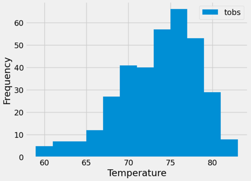

# Surfs Up SQLAlchemy

## Overview 
The purpose of this project was to conduct a climate analysis for Honolulu, Hawaii that can be used for vacation planning.

The following steps were completed to conduct this analysis:
<ol> •	Analyzed and explored the Hawaii climate database via the use of Python and SQLAlchemy </ol>
<ol> •	Studied the precipitation levels for the past year by using SQLAlchemy ORM queries, Pandas, and Matplotlib </ol>
<ol> •	Identified the most active Station and generated stats </ol>
<ol> •	Created a Flask API to design a climate app </ol>

## Results
<ul> Plotted results of 12 month precipitation data </ul>

 
<ul> Plotted results of 12 month TOBS data for the most active station </ul>

 

## Resources
#### Data Source: 
hawaii_measurements.csv, hawaii_stations.csv, hawaii.sqlite
#### Software: 
SQLAlchemy, Python, Jupyter Notebook, Flask, VSCode